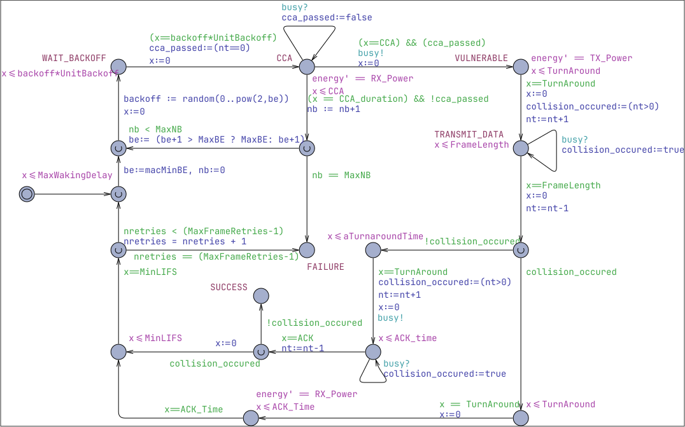

# Computing Nash Equilibrium in Wireless Ad Hoc Networks: A Simulation-Based Approach

_**Computing Nash Equilibrium in Wireless Ad Hoc Networks: A Simulation-Based Approach**_,
Peter E. Bulychev, Alexandre David, Kim G. Larsen, Axel Legay, Marius Mikučionis. *2nd Internation Workshop on Interactions, Games and Protocols (IWIGP 2012)*, March 25, 2012, Electronic Proceedings in Theoretical Computer Science (EPTCS). [[DOI:10.4204/EPTCS.78.1](https://doi.org/10.4204/EPTCS.78.1)]

## Abstract

This paper studies the problem of computing Nash equilibrium in wireless networks modeled by
Weighted Timed Automata. Such formalism comes together with a logic that can be used to describe
complex features such as timed energy constraints. Our contribution is a method for solving this
problem using Statistical Model Checking. The method has been implemented in UPPAAL model
checker and has been applied to the analysis of Aloha CSMA/CD and IEEE 802.15.4 CSMA/CA
protocols.

## Model Files

Uppaal SMC model of CSMA/CA protocol: [csma-ca.xml](csma-ca.xml)

Image from the protocol model:

