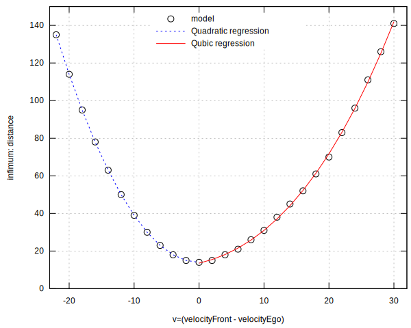

# Guaranteed Control Synthesis for Continuous Systems in UPPAAL TIGA

_**[Guaranteed Control Synthesis for Continuous Systems in UPPAAL TIGA](GuaranteedControl-CyPhy2018)**_, Kim Guldstrand Larsen, Adrien Le Coënt, Marius Mikučionis and Jakob Haahr Taankvist (2018). In: Roger Chamberlain, Walid Taha, and Martin Törngren (eds) Cyber Physical Systems. Model-Based Design. CyPhy WESE 2018. Lecture Notes in Computer Science, vol 11615, Springer, Cham. [[DOI]](https://doi.org/10.1007/978-3-030-23703-5_6) [[Springer]](https://link.springer.com/chapter/10.1007/978-3-030-23703-5_6)

## Abstract
We present a method for synthesising control strategies for continuous dynamical systems. We use UPPAAL TIGA for the synthesis in combination with a set-based Euler method for guaranteeing that the synthesis is safe. We present both a general method and a method which provides tighter bounds for monotone systems. As a case-study, we synthesize a guaranteed safe strategy for a simplified adaptive cruise control application. We show that the guaranteed strategy is only slightly more conservative than the strategy generated in the original adaptive cruise control paper which uses a discrete non guaranteed strategy. Also, we show how reinforcement learning may be used to obtain optimal sub-strategies.

## Model Files

- [cruise2.xml](cruise2.xml)
- [cruise_general.xml](cruise_general.xml)
- [cruise_minmax.xml](cruise_minmax.xml)
- [cruise_plot.xml](cruise_plot.xml)
- [d2i.c](d2i.c) source for external function `int d2i(double)` which can be replaced with native function call `fint(x)` [available since Stratego-7 and also in Uppaal-5](https://docs.uppaal.org/language-reference/expressions/).
- [d2i_minmax.c](d2i_minmax.c) source for external functions `int flo(double)` and `int cei(double)` which can be replaced with corresponding native function calls `fint(floor(x))` and `fint(ceil(x))` [available since Stratego-7 and also in Uppaal-5](https://docs.uppaal.org/language-reference/expressions/).

## Result Postprocessing

- [inf-dist.csv](inf-dist.csv) velocity and minimum safe distance.
- [inf-dist-lm.R](inf-dist-lm.R) script for finding refression curves for minimum safe distance.
- [inf-dist-lm1.csv](inf-dist-lm1.csv) regression curve for negative velocities.
- [inf-dist-lm2.csv](inf-dist-lm2.csv) regression curve for positive velocities.
- [inf-dist-lm2.plot](inf-dist-lm2.plot) GNU Plot script to create the below plot of the above data.
- [inf-dist-lm2.pdf](inf-dist-lm2.pdf) Minimum safe distance for each velocity difference plot.

