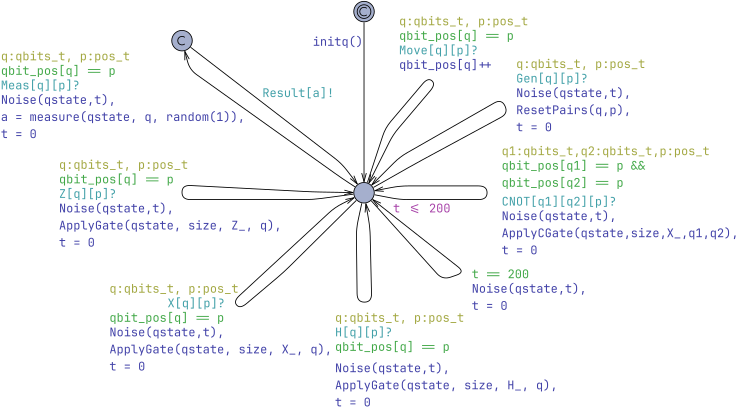

# Analysis and Verification of Quantum Communication Protocols in UPPAAL
This folder contains artifacts for "Analysis and Verification of Quantum Communication Protocols in UPPAAL" paper for CAV'26.

Download the entire artifact: [artifact.zip](artifact.zip)

## Model Previews

### [bsdc-enumerated](bsdc-enumerated.xml)

2-bit quantum process:

Sender:

Receiver:

Monitor with two buffers:

Monitor with sliding-window buffer:

### [bsdc-density-matrix.xml](bsdc-density-matrix.xml)

Quantum process with density matrix operations:

Distiller:

Sender with distillation:

### [bsdc-experiments.xml](bsdc-experiments.xml)
