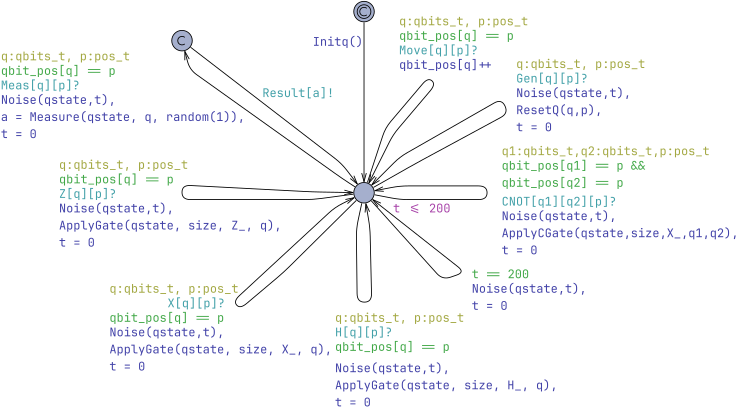
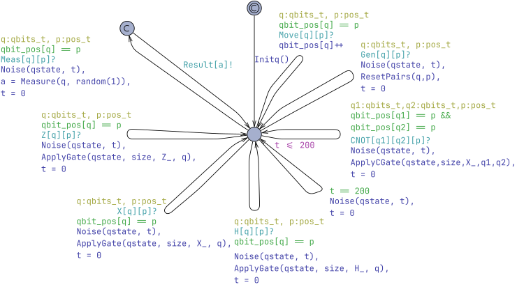
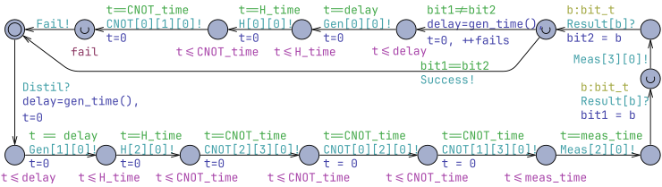
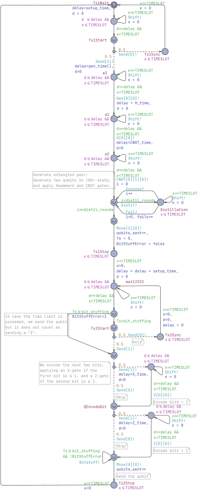

# Analysis and Verification of Quantum Communication Protocols in UPPAAL
This folder contains artifacts for "Analysis and Verification of Quantum Communication Protocols in UPPAAL" paper for CAV'26.

Download the entire artifact with instructions in `README.md`: [artifact.zip](artifact.zip)

## Model Previews

### bsdc-enumerated.xml

2-bit quantum process `Quantum2`:

Sender process `SenderTimeslotted`:

Receiver `ReceiverTimeslotted`:

`Monitor` with two buffers:

Monitor with sliding-window buffer (`MonitorOld`):

### bsdc-density-matrix.xml

Quantum process with density matrix operations `Qstate2` for 2 qubits:

Quantum process with density matrix operations `Qstate4` for 4 qubits:

`Distiller`:

Sender with distillation `SenderShifting`:

