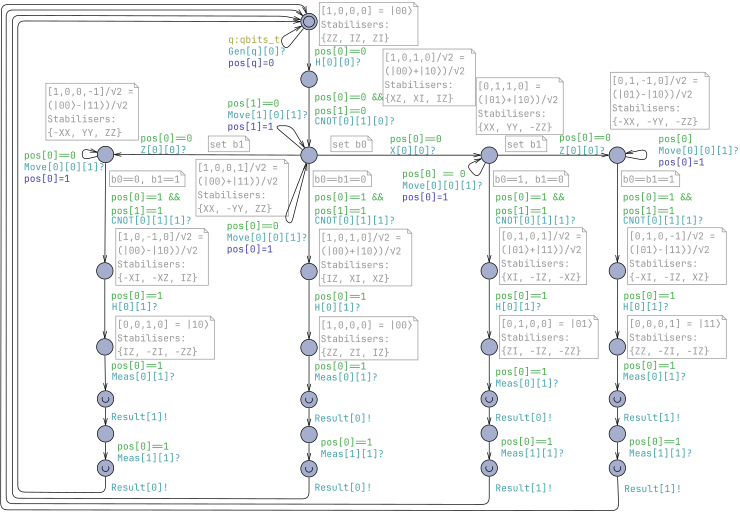
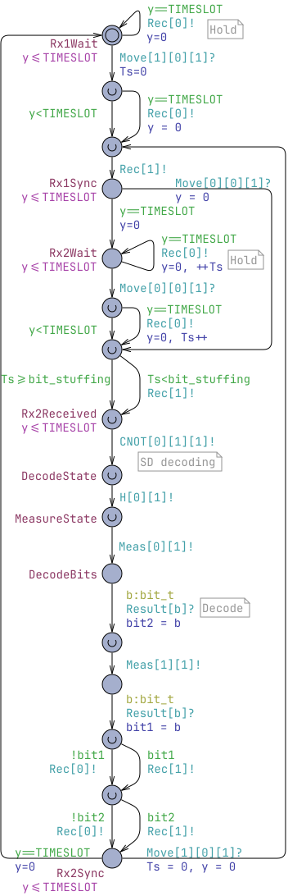
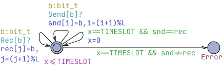
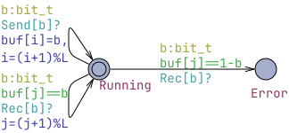

# Analysis and Verification of Quantum Communication Protocols in UPPAAL
This folder contains artifacts for "Analysis and Verification of Quantum Communication Protocols in UPPAAL" paper for CAV'26.

## Overview

The folder contains the following artifacts:
* [bsdc-enumerated.xml](bsdc-enumerated.xml) - a self-contained BSDC model for 2 qubits with enumerated quantum states.
* [bsdc-density-matrix.xml](bsdc-density-matrix.xml) - a full BSDC model for 4 qubits with noise and distillation, shifts using density matrices and Armadillo library. The model is polished for readability.
* [bsdc-experiments.xml](bsdc-experiments.xml) - not so clean version used in experiments.
* dmqs - C++ library linking with Armadillo, required by bsdc-density-matrix.xml and bsdc-experiments.xml.

Below are instructions on how to reproduce the figures from the paper and also a previews of the models.

## Instructions

1. Download and install UPPAAL:
 * Either version 5.0 or 5.1 from [UPPAAL.org](https://uppaal.org/downloads/)
 * UPPAAL graphical interface requires Java Runtime Environment (JRE or JDK) installed, we recommend OpenJDK 25 from:
   - Linux distribution
   - [Adoptium](https://adoptium.net/) (may require administrative rights)
   - [Microsoft](https://www.microsoft.com/openjdk) (possible to install for local user environment)
 * Obtain an academic license key:
   - Register at [veriaal.dk](https://uppaal.veriaal.dk/academic.html)
   - Or use our key: dd5bd740-8262-4fce-b6ee-5b2549c8a3c0

2. Reproduce snippets in Fig.3 by opening bsdc-enumerated.xml in UPPAAL:
  * In Editor:
    - select Quantum2 and inspect the path shown in Quantum of Fig.3.
    - select SenderTimeslotted and observe the beginning matching in Sender of Fig.3.
    - select ReceiverTimeslotted and observe the beginning matching in Receiver of Fig.3.
    - select Monitor and check that is equal to Monitor of Fig.3.
  * In Verifier, check that the two properties are satisfied:
    - `A[] not deadlock`
    - `A[] not monitor.Error`
  * Alternatively, check the properties on a command line:
  ```shell
  verifyta bsdc-enumerated.xml
  ```

3. Reproduce snippets in Fig.4 by openning bsdc-density-matrix.xml in UPPAAL:

...

4. Reproduce Fig.5

...

4. Reproduce Fig.6

...

## Model Previews

### [bsdc-enumerated](bsdc-enumerated.xml)

2-bit quantum process:


Sender:


Receiver:


Monitor with two buffers:


Monitor with sliding-window buffer:


### [bsdc-density-matrix.xml](bsdc-density-matrix.xml)


### [bsdc-experiments.xml](bsdc-experiments.xml)
