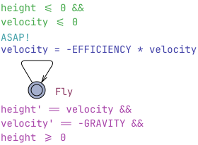
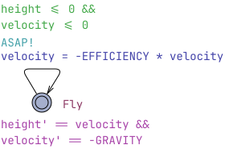

# Bouncing Ball Walkthrough

Let's make a model for a simple bouncing ball which can be described as follows:

1. Gravitational constant on Earth: $g = 9.81$
2. The initial height is $h(0) = 10.0$ above the floor (floor is at height $0$).
3. The initial (vertical) velocity $v(0) = 0$.
4. The height changes with a rate of velocity: $h'(t) = v(t)$
5. The velocity changes with a rate of graviational acceleration: $v'(t) = g$
6. When the ball hits the floor ($h(t) == 0$ for some value of $t$) it bounces by inverting the velocity with some efficiency $0.8$.

The above can be typeset in UPPAAL using the following variable declarations:
```c
const double GRAVITY = 9.81;
const int FLOOR = 0;
const double EFFICIENCY = 0.8;
clock height = 10.0;
clock velocity = 0.0;
```

The dynamics can be modeled using differential equations at one process location invariant with an edge for inverting the velocity during bounce:


However UPPAAL complains: *"A general hybrid guard is enabled without urgent synchronization"*, which means that the guard condition is too complicated to find all time intervals where the guard is satisfied and it suggests making it `urgent`.
This error is issued when the guard expression is more complicated than a clock constraint and/or the involved clock is also constrained by a derivative equation in the invariant.

We make the edge urgent by adding a shouting synchronization over `urgent broadcast chan ASAP;` channel:



UPPAAL may warn with "Clock guards are not allowed on urgent edges" because symbolic engine does not support it, but in SMC this can be ignored.

Then simulate and plot the `height` and `velocity`:
```c
simulate [<=15]{ ball.height, ball.velocity }
```
However UPPAAL pops up with an error: *"Time-lock error: in ball.Fly State: ( ball.Fly ) #t(0)=0 #time=11.43438 ball.height=0 ball.velocity=0.00143"*
The `#time` value shows the absolute model time `11.43438`, meaning that it managed to simulate up to that point and it ran into `time-lock`.

The reason is that the system behavior is constrained exactly and Runge-Kutta integrator fails to hit the exact point `height == FLOOR` where invariant expires and the guard becomes enabled. Since the edge is taken as soon as the guard is enabled anyway, we can relax the invariant by removing `height >= FLOOR`:



Which allows the integrator to overshoot a bit, which can be minimized by tuning the error bounds in the `Options` > `Statistical parameters...`  > `Discetization step for hybrid systems`, `Local integration error bound`, `Integration error bound pr. time-unit`.

This model goes a bit further but gets stuck with another error: *"Probably Zeno behavior (infinitely many discrete transitions in finite amount of time): Executed more than 100000 discrete transition while delaying only 0.000145868 time units. State: ( ball.Fly ) #t(0)=0#time=11.43452 ball.height=-1.4100e-05 ball.velocity=-0"*

The error says that the ball has bounced 100000 times within `0.000145868` time units, which looks like Zeno behavior.

We fix the model by adding an escape edge when the velocity is too small:


Finally the `simulate` query yields the following result:


The models:
- [Final model](Ball.xml)
- [Intermediate models](BallX.xml)
