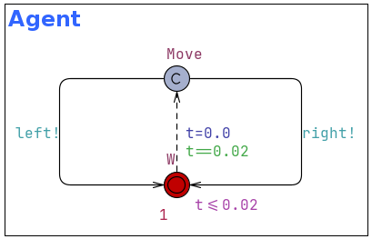
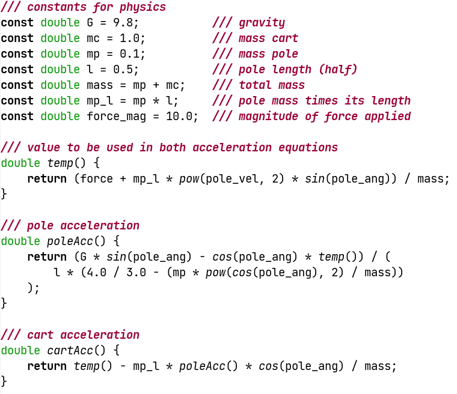
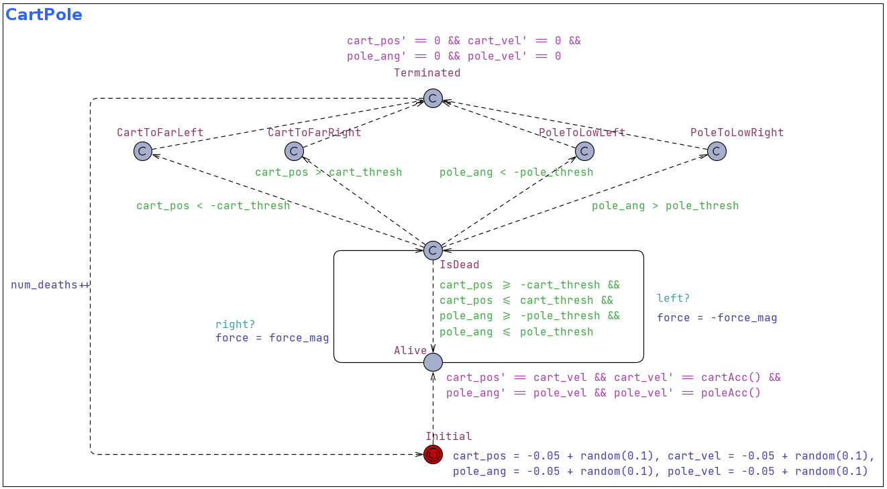

# CartPole model for UPPAAL Stratego

This model is a [UPPAAL Stratego][1] implementation of the classical
reinforcement learning problem, where an agent has to balance a pole vertically
on a moving cart. The model corresponds to the [Gymnasium environment][4] that
is widely used in testing RL techniques.

([source][2])

## Model description

The model consists of an always moving cart that can either move left or
right on a flat, horizontal surface. On top of the cart, a pole is balancing and
the learning agent has to keep the pole standing upright by changing the
direction of the cart without letting it travel to far in either direction.
The agent is handed control every 0.02 seconds and then has to decide in which
direction to push the cart.

The observable state space for the agent is 4-dimensional and consists of the
position and velocity of the cart, the angle of the pole and the velocity with
which the pole is falling. In the initial location of the model, all these
variables are instantiated with a random value between -0.05 and 0.05. The main
location for the CartPole model is when it is alive. Here the position of the
cart and the angle of the pole are set to change according to the corresponding
velocities. On the other hand, the velocities are updated by a set of functions
which are described in detail in [the paper][3] by Florian,
R. (2007). They are quite intricate and depends on the mass of the cart, the
mass and length of the pole and the magnitude of the force that gets applied.

In this model, the functions are written up so it is easy to change these
values but by default they are set to match the configuration of the Gymnasium
environment that this model is supposed to correspond to.

Whenever the agent takes an action, the CartPole model visits the IsDead
location, where there effectively happens a check for whether the agent has lost
or is able to continue. There are four ways to lose: the cart is to far to the
left, the cart is to far to the right, the pole is to low on the left or the
pole is to low on the right. If none of these are true, the model transitions
back to the Alive location. Otherwise, the agent is terminated, the system is
reset and the death counter is increased by one.

## Training and evaluation

For evaluation, we will start by getting UPPAAL Stratego to calculate the
expected number of deaths when we apply random control. The query `E[<=10;1000]
(max: CartPole.num_deaths)` estimates the maximal number of deaths over 10
seconds on the basis of 1000 simulated runs. We see, that this estimation lies
about 23, which indicates a pretty poor control strategy.

We therefore train a strategy that has access to the aforementioned state
variables and has the objective to minimize the number of deaths. The query
`strategy StayAlive = minE (CartPole.num_deaths) [<=10] {} ->
{CartPole.cart_pos, CartPole.cart_vel, CartPole.pole_ang, CartPole.pole_vel}:
<> time >= 10` does the job.

Now we can rerun the estimation query, but this time appending `under StayAlive`
to it in order to utilize our newfound strategy. We now see a dramatically
better performance as the estimated maximal number of deaths is less than
0.01 (might vary a bit from each execution of the query)! This means that UPPAAL
Stratego has done what every other RL technique worth its salt should be able to
do: solve the cartpole problem!

## Evaluating in the Gymnasium environment

We can assert that the strategy learned by UPPAAL Stratego is actually useful
outside Stratego. [Gymnasium][4] is a widely used Python framework for working
with a wide range of standard RL environments such as cartpole, and since this
model is based on that specific implementation, our Stratego strategies should
work in the Gymnasium setting. In the directory of this model are some Python
files that allow you to try this out!

First, be a good pythonista and create and activate a virtual environment using
your favorite method to do so (or just the easy method: `python3 -m venv ./env
&& source env/bin/activate`). Then run the command `pip install -r
requirements.txt` which will install Gymnasium and [stratetrees][5], a small
package designed to work with UPPAAL Stratego strategies in a Python setting.

Now you need to save a UPPAAL strategy as a json file. In UPPAAL, create a new
query that says `saveStrategy("/path/to/somewhere/strategy.json", StayAlive)`
(if your strategy is not called 'StayAlive', you should obviously write
something else at the end) and run it. Now you should be able to run the command
`python main.py --strategy /path/to/somewhere/strategy.json` and see your UPPAAL
Stratego strategy being applied on the Gymnasium environment!

As the output suggest, a perfect score would be to reach a mean of 500. That
will probably not be the case (more likely something like 490). This indicates
that the UPPAAL strategy is not perfect and has not solved the problem
completely. You can try and tinker with the learning parameters in UPPAAL
(Options -> Learning parameters...) or you can increase the number of seconds
in the training queries above (eg. change 10 to 20 to force it to learn to
balance for a longer time period).

[1]: https://people.cs.aau.dk/~marius/stratego/
[2]: https://tenor.com/view/reinforcement-learning-cartpole-v0-tensorflow-open-ai-gif-18474251
[3]: https://coneural.org/florian/papers/05_cart_pole.pdf
[4]: https://github.com/Farama-Foundation/Gymnasium/blob/main/gymnasium/envs/classic_control/cartpole.py
[5]: https://pypi.org/project/stratetrees/
